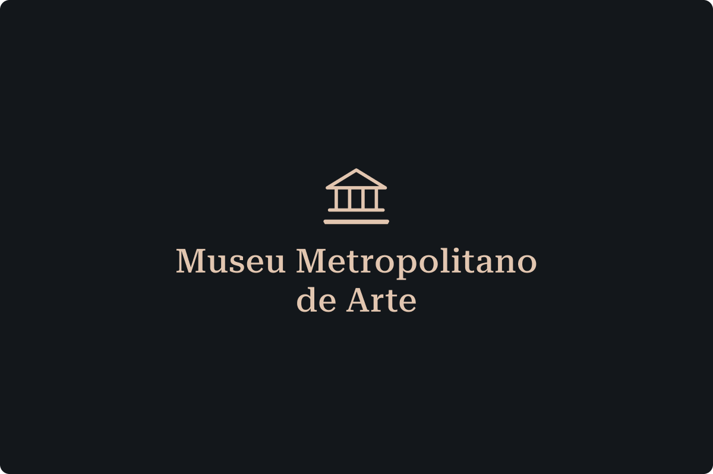

# App museu

Esta aplicação é a realização do desafio proposto para a vaga de Desenvolvedor Frontend Pleno na Insight Data Science Lab.

### Tecnologias

- [React](https://react.dev/)
- [Next.js](https://nextjs.org)
- [Stitches](https://stitches.dev/)
- [Lucide](https://lucide.dev/)
- [Radix](https://www.radix-ui.com/)
- [Keen Slider](https://keen-slider.io/)
- [Axios](https://axios-http.com/)
- [ClassNames](https://www.npmjs.com/package/classnames)

Além de outras APIs do navegador como: Intersection Observer, Resize Observer e do próprio React como: Context API.

### Como rodar

```bash
# Requisitos
  - Node instalado
  - Git instalado

# clone este repositório
git clone git@github.com:joaovictor3g/museum-app.git

# Na pasta do projeto, rode para instalação das dependềncias:
npm i

# Para rodar a aplicação
npm run dev
```

Com isso tudo feito, a aplicação deve estar disponível na url local: http://localhost:3000. A aplicação também se encontra no ar com deploy realizado na Vercel, no seguinte link: https://metropolitan-museum.vercel.app/
